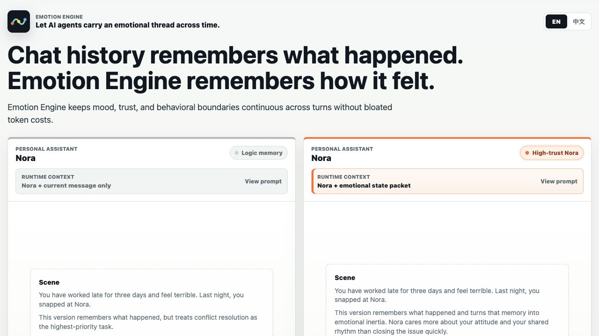

<p align="center">
  
</p>

# Emotion Engine

**Emotional continuity for LLM agents.**

[English](README.md) | [Chinese](README.zh-CN.md)

[](LICENSE)
[](https://www.python.org/)

Most AI agents can respond well in the moment, but they do not carry an emotional thread across time. They may sound warm in one turn, blank in the next, and forget whether the last interaction felt collaborative, tense, repaired, or unresolved.

Emotion Engine gives an LLM-powered agent a small, inspectable continuity layer: mood, trust, decay, boundaries, and compact emotional memories. The LLM still decides what happened and how to respond. Emotion Engine makes that judgment persistent.

Emotion Engine is part of PioneerJeff Labs, an open-source lab building reusable infrastructure layers for creative AI applications.

Status: experimental / v0.1.

## The Problem

Long-running agents need more than chat history.

Chat history stores what happened. Emotion Engine stores how the interaction has been feeling.

Without a continuity layer, an agent often treats every session as emotionally fresh. With Emotion Engine, an agent can carry forward lightweight signals such as:

- the last session was collaborative
- trust has grown slightly, but the relationship is still early
- a challenge felt productive rather than hostile
- the next response should be warm, steady, and clearly bounded

## What You Can Build

- Character agents that feel emotionally consistent across sessions.
- Personal assistants with gentle, user-controlled relational memory.
- AI companions that can become warmer or more bounded without storing full transcripts.
- Game NPCs or narrative agents whose mood evolves over time.
- Research prototypes for affective computing, agent memory, and human-agent interaction.

## How It Works

```text
User message
  -> LLM interprets the context
  -> LLM decides the final emotional meaning and response
  -> Emotion Engine stores PAD state, trust, and compact memory
  -> Future prompts receive continuity guidance
```

The split is intentional:

- The **LLM** makes the contextual judgment and generates the reply.
- The **Python helper** persists state, applies decay, records logs, extracts session patterns, and updates trust slowly.
- The deterministic `appraise` helper is only a fallback or debugging aid. It is not the source of truth in a real integration.

In short: **the LLM decides; Emotion Engine remembers.**

## Web Demo

The best first look is the side-by-side web demo in [demo](demo). It compares a baseline assistant with one using an Emotion Engine state packet, so the difference is visible as a conversation unfolds.

<p align="center">
  
</p>

The demo is based on adapted traces from previous real LLM interactions, not a purely fabricated benchmark. It is still curated for explanation: the browser does not call an LLM, does not generate live replies, and does not infer a real user's emotional state.

Open it directly:

```text
demo/index.html
```

Or serve the repository locally:

```bash
python3 -m http.server 4173 --bind 127.0.0.1
```

Then visit:

```text
http://127.0.0.1:4173/demo/
```

## Local State Checks

The Python scripts are not the main product demo. They are developer-facing checks for the core state layer: useful for validating lifecycle behavior, debugging integrations, and proving the shared engine still works under OpenClaw, Claude Skill, Hermes Agent, or another host.

Run a lifecycle check without installing any agent runtime:

```bash
python3 scripts/check_state_lifecycle.py --style "warm but not over-compliant, with clear boundaries"
```

This does not call an LLM and does not generate assistant replies. It checks that the state layer works: configure, session start, decay, advisory appraisal, record turn, session end, trust update, and emotion log.

To see the kind of guidance an LLM integration would receive:

```bash
python3 scripts/prompt_preview.py \
  --style "calm, reliable, and clearly bounded" \
  --message "Thanks, the last version is much clearer. I want to challenge one part of the design."
```

Example guidance:

```text
Current continuity state:
- Tone: warm, steady, firm
- Trust tier: New
- Style: mildly warm; calm; strongly bounded

Advisory appraisal:
- The helper sees this message as collaboration.

LLM task:
- Interpret the message using full context.
- Decide the final appraisal and PAD update.
- Generate a natural reply shaped by the current state.
- Record a compact emotional memory after the turn.
```

## Which Package Should I Use?

| Need | Use |
|---|---|
| Scripted web demo for product explanation | [demo](demo) |
| Core state engine checks and local tooling | [scripts](scripts) |
| OpenClaw skill | [integrations/openclaw](integrations/openclaw) |
| Claude Skill / Claude Code package | [integrations/claude-skill](integrations/claude-skill) |
| Hermes Agent skill package | [integrations/hermes](integrations/hermes) |

The repository root is the Emotion Engine project. Platform-specific packages live under `integrations/`.
The first-party starter integrations are OpenClaw, Claude Skill, and Hermes Agent.

## Integrations

### OpenClaw

The OpenClaw-compatible package lives in [integrations/openclaw](integrations/openclaw).

For local OpenClaw installation:

```bash
cd integrations/openclaw/emotion-engine
./install.sh
```

The installer:

- copies the skill into your OpenClaw workspace
- creates `emotion-state.json` if missing
- preserves existing state if one already exists
- lets you describe the agent's style in one sentence
- prints a natural-language status so you can see it is working

Example style:

```text
warm but not over-compliant, with clear boundaries
```

To build an OpenClaw upload zip:

```bash
cd integrations/openclaw
./package_openclaw_skill.sh
```

This creates `emotion-engine-openclaw-skill.zip`.

### Claude Skill

The Claude-compatible package lives in [integrations/claude-skill](integrations/claude-skill).

For Claude Code:

```bash
cd integrations/claude-skill/emotion-engine
./install.sh
```

To build a Claude Skills upload zip:

```bash
cd integrations/claude-skill
./package_claude_skill.sh
```

This creates `emotion-engine-claude-skill.zip`. The zip is a generated release artifact, so it is not committed to the repository.

### Hermes Agent

The Hermes-compatible package lives in [integrations/hermes](integrations/hermes).

For local Hermes installation:

```bash
cd integrations/hermes/emotion-engine
./install.sh
```

To build a Hermes skill zip:

```bash
cd integrations/hermes
./package_hermes_skill.sh
```

This creates `emotion-engine-hermes-skill.zip`. The zip is a generated release artifact, so it is not committed to the repository.

## Core Concepts

Emotion Engine stores and updates:

- **PAD state**: Pleasure, Arousal, Dominance.
- **Trust**: a slow-moving relationship coefficient.
- **Personality baseline**: where the agent naturally drifts back to.
- **Emotion trajectory**: numeric state during a session.
- **Emotion log**: compact emotional memories, not full transcripts.
- **Session patterns**: conflict, repair, volatility, suppression, and trust signals.

Read more in [Concepts](docs/CONCEPTS.md).

## Integration

The typical integration loop is:

1. Load the current state.
2. Apply session or turn decay.
3. Let the LLM interpret the user message and choose the final emotional update.
4. Record the turn with compact memory.
5. Use the updated state as guidance for future replies.
6. At session end, extract patterns and update trust.

See [Integration Guide](docs/INTEGRATION.md) for the full sequence.

## CLI

```bash
python3 scripts/emotion_engine_utils.py init <state_file>
python3 scripts/emotion_engine_utils.py validate <state_file>
python3 scripts/emotion_engine_utils.py configure <state_file> --style <description>
python3 scripts/emotion_engine_utils.py configure <state_file> --soul-file <SOUL.md>
python3 scripts/emotion_engine_utils.py tune <state_file> <natural-language adjustment>
python3 scripts/emotion_engine_utils.py status <state_file>
python3 scripts/emotion_engine_utils.py pause <state_file>
python3 scripts/emotion_engine_utils.py resume <state_file>
python3 scripts/emotion_engine_utils.py session_start <state_file>
python3 scripts/emotion_engine_utils.py pre_turn_decay <state_file>
python3 scripts/emotion_engine_utils.py appraise <state_file> <message...>
python3 scripts/emotion_engine_utils.py record_turn <state_file> <P> <A> <D> --appraisal <label> --situation <what happened>
python3 scripts/emotion_engine_utils.py session_end <state_file>
python3 scripts/emotion_engine_utils.py update_trust <state_file> <trust_delta>
python3 scripts/emotion_engine_utils.py recent_log <state_file> 5
```

## What It Is Not

Emotion Engine is not a chatbot and does not generate replies by itself.

It is also not an emotion detector, mental health tool, or psychological assessment system. It models fictional or agent-internal continuity, not a real person's emotional state.

## Brand Assets

Starter logo assets live in [assets](assets). Brand guidance lives in [Brand Notes](docs/BRAND.md).

## Project Structure

```text
emotion-engine/
├── emotion-state-template.json
├── scripts/
│   ├── emotion_engine_utils.py
│   ├── check_state_lifecycle.py
│   ├── prompt_preview.py
│   └── simulate_state_lifecycle.py
├── integrations/
│   ├── openclaw/
│   ├── claude-skill/
│   └── hermes/
├── tests/
├── docs/
├── demo/
├── assets/
├── README.md
├── README.zh-CN.md
├── LICENSE
├── CHANGELOG.md
├── CONTRIBUTING.md
└── SECURITY.md
```

## Roadmap

- Clearer LLM integration examples.
- Optional real chat demo using an API key or local model.
- More appraisal examples and tests.
- Portable state format for future memory migration work.
- Better examples for character agents, personal assistants, and game NPCs.

## Safety And Ethics

Emotion Engine models fictional or agent-internal emotional continuity. It does not detect, diagnose, or verify a real person's emotional or mental state.

Do not use this project to manipulate attachment, pressure users into engagement, punish absence, or make consequential decisions about people. Treat the state as a creative and interaction-design tool, not as psychological truth.

## License

MIT. See [LICENSE](LICENSE).
