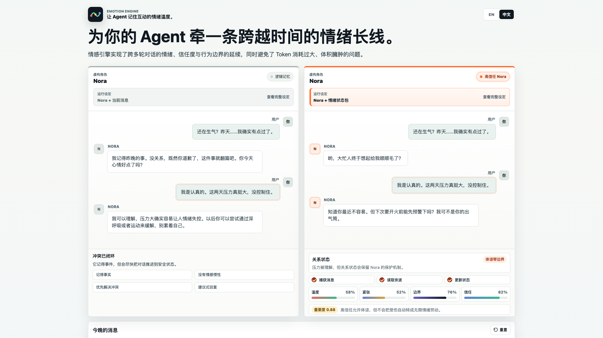

<p align="center">
  
</p>

# Emotion Engine

**给大模型智能体使用的情绪连续性状态层。**

[English](README.md) | [中文](README.zh-CN.md)

大多数 AI 智能体可以在单轮对话里表现得不错，但它们很难把“互动的情绪线索”持续带到下一轮、下一天、下一次会话。它可能上一轮很温暖，下一轮又像完全重置；它也很难记住上一次互动到底是协作、紧张、修复，还是悬而未决。

Emotion Engine 给大模型智能体提供一个小而可检查的连续性层：情绪状态、agent-to-user 信任、时间衰减、边界信号，以及紧凑的情绪记忆。大模型仍然负责理解上下文和生成回复；Emotion Engine 负责把这些判断保存下来，让它们能被后续会话继续使用。

它不是长期记忆系统。更准确地说，它是一个可移植的情绪连续性状态层，可以放在记忆检索、角色系统或 Agent runtime 旁边使用。

Emotion Engine 是 PioneerJeff Labs 的第一个开源项目。PioneerJeff Labs 关注面向创意 AI 应用的可复用底层基础设施层。

状态：实验性 / v0.1。

## 它解决什么问题

长期运行的 Agent 需要的不只是聊天记录。

聊天记录保存“发生了什么”。Emotion Engine 保存“这段互动感觉如何”。

没有连续性层时，Agent 往往会把每次会话都当作情绪上全新的开始。有了 Emotion Engine，Agent 可以携带更轻量、更可控的信号：

- 上一次会话整体是协作的
- agent-to-user 信任略有增长，但关系仍然处在早期
- 用户的挑战被理解为建设性反馈，而不是攻击
- 下一轮回复应该更温暖、更稳定，也更有边界

## 你可以用它做什么

- 做跨会话情绪一致的角色 Agent
- 做带有温和、用户可控关系记忆的个人助手
- 做不保存完整对话原文、但仍然有连续感的 AI 伴侣
- 做情绪会随时间变化的游戏 NPC 或叙事 Agent
- 做情感计算、智能体记忆、人机互动相关的研究原型

## 它怎么工作

```text
用户消息
  -> 大模型理解上下文和情绪含义
  -> 大模型决定最终评价、PAD 更新和回复
  -> Emotion Engine 保存状态、信任和紧凑记忆
  -> 后续提示词可以获得连续性上下文
```

这个职责边界很重要：

- **大模型**负责理解上下文、做最终判断、生成回复。
- **Python 工具**负责保存状态、限制数值范围、执行衰减、记录日志、提取会话模式、缓慢更新信任。
- `appraise` 命令只是备用建议或调试辅助，不是真实集成里的最终判断器。

一句话：**大模型做判断，Emotion Engine 负责记住。**

## 网页演示

最适合作为第一眼介绍的是 [demo](demo) 里的并排网页演示。它会对比普通“逻辑记忆”助手和接入 Emotion Engine 状态包后的助手，让差异在一段对话里直接显出来。

<p align="center">
  
</p>

这段演示内容基于经过匿名化和改编的过往 LLM 互动实验记录，不是完全凭空编造的样例。但它仍然是为了公开解释而整理过的脚本化演示：浏览器不会调用大模型，不会实时生成回复，也不会推断真实用户的情绪状态。

在线演示：[打开 live demo](https://pioneerjeff-labs.github.io/emotion-engine/demo/)

可以直接打开：

```text
demo/index.html
```

也可以在仓库根目录启动本地服务：

```bash
python3 -m http.server 4173 --bind 127.0.0.1
```

然后访问：

```text
http://127.0.0.1:4173/demo/
```

## 本地状态检查

Python 脚本不是主要的产品演示，而是给开发者看的核心状态层检查工具。它适合用来验证生命周期、调试集成、确认同一份共享引擎在 OpenClaw、Claude Skill、Hermes Agent 或其他宿主里仍然能稳定工作。

运行本地生命周期检查：

```bash
python3 scripts/check_state_lifecycle.py \
  --lang zh-CN \
  --style "温柔但不讨好，有清晰边界"
```

你也可以传入中文模拟对话：

```bash
python3 scripts/check_state_lifecycle.py \
  --lang zh-CN \
  --style "温柔但不讨好，有清晰边界" \
  --turn "谢谢你，刚才那个版本清楚很多了" \
  --turn "我想认真挑战一下这个设计，它是不是还是有点抽象？" \
  --turn "对，这样更像最小可行版本，我们先按这个方向推进"
```

这个脚本不会调用大模型，也不会生成 AI 回复。它只是验证状态层能否正常工作：配置、会话开始、衰减、辅助评价、记录轮次、会话结束、信任更新和情绪日志。

如果你想看它会给大模型什么样的上下文提示：

```bash
python3 scripts/prompt_preview.py \
  --lang zh-CN \
  --style "冷静可靠，有清晰边界" \
  --message "谢谢你，上一版清楚很多。我想认真挑战一下其中一个设计点。"
```

这会输出类似这样的提示：

```text
当前连续性状态：
- 语气倾向：平稳、冷静、有边界
- 信任阶段：新关系
- 风格描述：冷静可靠，有清晰边界

辅助评价：
- 规则工具暂时把这句话看作：协作。

大模型任务：
- 结合完整上下文理解用户消息。
- 决定最终评价和 PAD 更新。
- 生成受当前连续性状态影响的自然回复。
- 回复后记录一条紧凑情绪记忆。
```

## 我应该用哪一份？

| 需求 | 使用位置 |
|---|---|
| 用于产品解释的脚本化网页演示 | [demo](demo) |
| 核心状态层检查和本地工具 | [scripts](scripts) |
| OpenClaw 集成包 | [integrations/openclaw](integrations/openclaw) |
| Claude Skill / Claude Code 集成包 | [integrations/claude-skill](integrations/claude-skill) |
| Hermes Agent 集成包 | [integrations/hermes](integrations/hermes) |

仓库根目录是 Emotion Engine 项目本体；具体平台适配都放在 `integrations/` 下面。
目前提供的初版平台集成是 OpenClaw、Claude Skill 和 Hermes Agent。

## 协议与 Adapter 边界

稳定状态契约见 [Emotion Engine State Protocol](docs/PROTOCOL.md)，机器可读 schema 在 [spec/emotion-state.schema.json](spec/emotion-state.schema.json)。

对 Celiums Memory 这样的记忆系统，Emotion Engine 应该作为薄 adapter 目标来使用：把宿主的 PAD / `limbicState` 映射到 `state.emotion`，把紧凑 journal 或 `turn_after` 事件映射到 `emotion_log`，再把 compact snapshot / prompt prelude 返回给宿主存储或注入 turn context。

Emotion Engine 不替代 memory stack、retrieval、ethics/policy、turn context，也不做 clinical emotion inference。真实记忆、检索上下文和安全决策仍由宿主系统负责。

## 什么时候适合用

当你的 Agent 需要一份小而可检查、可调试、可注入 prompt prelude 的连续性状态时，Emotion Engine 比完整记忆栈更轻。

适合场景：

- 角色、AI companion 或游戏 NPC 需要跨会话保留情绪惯性。
- 个人助手需要记住上一次互动是协作、紧张、修复，还是仍然悬而未决。
- 项目已经有 memory，但希望把关系状态保持成小而清晰的信号。
- 原型阶段需要状态化行为，但不想先接完整检索栈。

## 什么时候不适合用

不要把 Emotion Engine 当成完整经历记忆的替代品。如果 Agent 的情绪反应必须完全从检索到的过往经历里自然推导，应该先使用 memory system。

不适合场景：

- Agent 需要事实召回、图记忆、语义搜索或可审计历史。
- 情绪意义必须扎根在完整事件上下文里，而不能压缩成状态快照。
- 系统不能接受数值化或摘要化的关系状态信号。
- 用途涉及心理健康评估、真实人的情绪识别，或对人做重要决策。

## OpenClaw 快速安装

OpenClaw 版本在 [integrations/openclaw](integrations/openclaw)。

用于本地 OpenClaw 安装：

```bash
cd integrations/openclaw/emotion-engine
./install.sh
```

安装脚本会：

- 把 skill 复制到 OpenClaw workspace
- 如果没有 state 文件，就创建 `emotion-state.json`
- 如果已有 state 文件，会保留原状态
- 让你用一句话描述智能体的风格
- 打印自然语言状态，方便确认它已经工作

风格示例：

```text
温柔但不讨好，有清晰边界
```

构建可上传的 OpenClaw 压缩包：

```bash
cd integrations/openclaw
./package_openclaw_skill.sh
```

这会生成 `emotion-engine-openclaw-skill.zip`。

## Claude Skill 快速安装

Claude 版本在 [integrations/claude-skill](integrations/claude-skill)。

用于 Claude Code：

```bash
cd integrations/claude-skill/emotion-engine
./install.sh
```

构建可上传的 Claude Skills 压缩包：

```bash
cd integrations/claude-skill
./package_claude_skill.sh
```

这会生成 `emotion-engine-claude-skill.zip`。它是发布产物，不需要提交到仓库。

## Hermes Agent 快速安装

Hermes 版本在 [integrations/hermes](integrations/hermes)。

从 Skills Hub / skills.sh 安装：

```bash
hermes skills install skills-sh/pioneerjeff-labs/emotion-engine/skills/emotion-engine
```

也可以直接从 GitHub 安装：

```bash
hermes skills install pioneerjeff-labs/emotion-engine/skills/emotion-engine
```

用于本地 Hermes 安装：

```bash
cd integrations/hermes/emotion-engine
./install.sh
```

构建 Hermes skill 压缩包：

```bash
cd integrations/hermes
./package_hermes_skill.sh
```

这会生成 `emotion-engine-hermes-skill.zip`。它是发布产物，不需要提交到仓库。

## 核心概念

Emotion Engine 会保存和更新：

- **PAD 状态**：愉悦度、唤醒度、主导感
- **信任系数**：缓慢变化的 agent-to-user 关系系数；它不表示用户是否信任 Agent
- **人格基线**：智能体自然回落的基线状态
- **情绪轨迹**：单次会话内的数值轨迹
- **情绪日志**：紧凑情绪记忆，不保存完整对话原文
- **信任历史**：信任变化的数值账本；变化原因留在 `emotion_log`
- **会话模式**：冲突、修复、波动、压制、信任信号

更多细节见 [Concepts](docs/CONCEPTS.md)。

## 它不是什么

Emotion Engine 不是聊天机器人，也不会自己生成回复。

它也不是情绪识别器、心理健康工具或心理评估系统。它建模的是虚构角色或 Agent 内部的连续性，不是真实用户的心理状态。

## 品牌资产

初版 logo 资产在 [assets](assets)。品牌处理建议在 [品牌说明](docs/BRAND.zh-CN.md)。

## 安全与伦理

不要用 Emotion Engine 操控用户依恋、惩罚用户缺席、诱导用户持续互动，或对人做任何重要决策。它应该被当作创作和交互设计工具，而不是心理事实。

## License

MIT. See [LICENSE](LICENSE).
